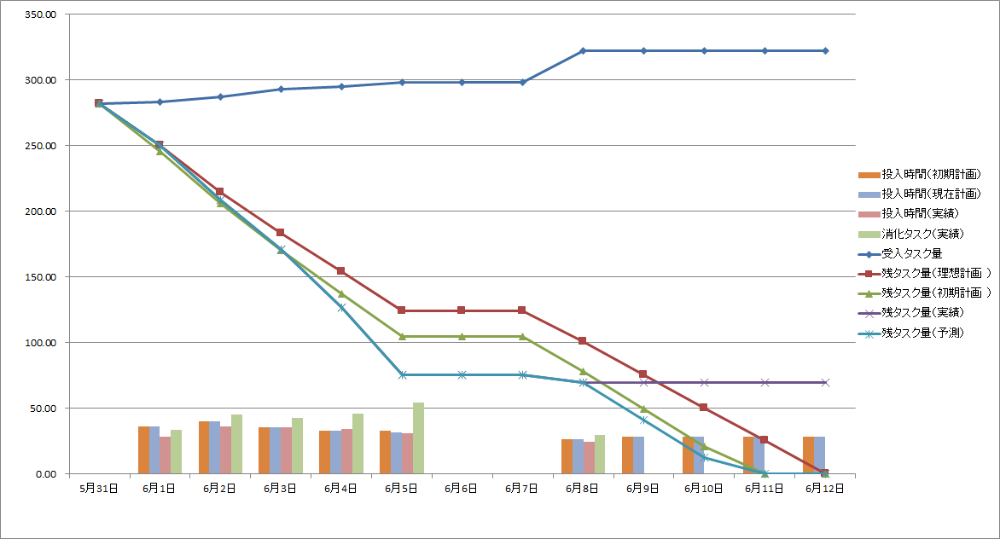
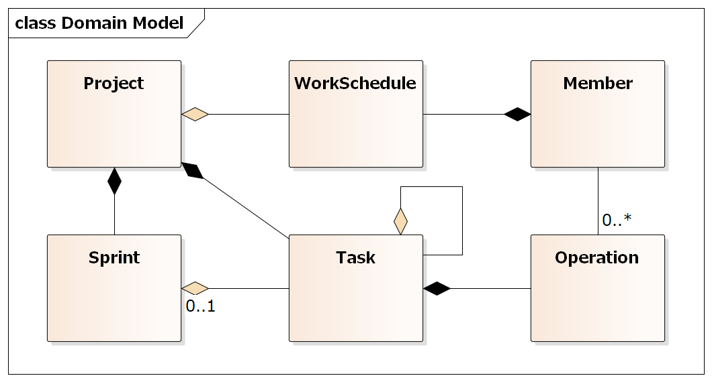

# Lightningfall

## プロジェクトの目的

Lightningfallプロジェクトは、以下を目的としたOSSプロジェクトです。

* 実用可能なプロジェクト管理アプリケーションの開発
* リファレンスとできるアプリケーションアーキテクチャの継続的な探究

ただし開発方針としては、当面は動くものを開発することを優先します。主要な機能がそろった段階から全体をリファクタリングしてアーキテクチャサンプルとして成り立つ品質に洗練していくこととします。

またアプリケーションを実プロジェクトで利用し、そのフィードバックから継続的な改善を行い、また時代に即したアーキテクチャへ継続的にモダン化し続けます。

## プロダクトの特徴

Lightningfallは次の特徴をもったプロジェクト管理アプリケーションを目指します。
このプロジェクトでは次のような特徴をもったプロジェクト管理アプリケーションの開発を目指します。

* 中長期的な管理をガントチャートで、短期（スプリント）的な管理をバーンダウンチャートで行う
* 中長期的な管理はWEBとガントチャートで管理し、タスクの依存関係を含めて管理する
* 短期（スプリント）的な管理はWEBとバーンダウンチャートを用いて管理し、タスクの依存関係は管理しない
* チャートを用いたグラフィカルなダッシュボード
* Microsoft ProjectとのImport/Export

バーンダウンチャートは以下のような情報を管理できるものを想定します。

以下のようなドメインモデルを想定しています。

## プロダクトのアーキテクチャ

また本プロジェクトでは、次のアーキテクチャを採用したサンプルアプリケーションを目指します。

* ドメイン駆動設計
* Clean Architecture

技術的なアーキテクチャとしては次の選択します。

* WPF
    * MaterialDesignInXamlToolkit
    * Infragistics WPF or Syncfusion WPF Controls or ...
* Web APIを用いたWeb3層モデル
* 複数のRDBサポート（SQL ServerとSQLiteくらいか？）
* Presentasion層以外の十分な自動テスト

